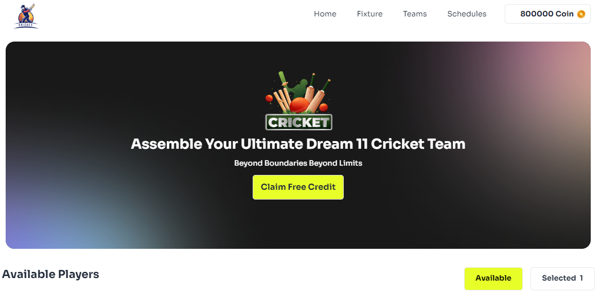

# BPL Dream Eleven React Project

In this project it's all about to hire player to create a perfect cricket team.



Live Deploy Link : [Live](https://bpl-super-six-dream-eleven.surge.sh/)


## Technologies

[React + Vite](https://vite.dev/guide/)
```bash
  1. npm create vite@latest bpl-dream-eleven-react-project -- --template react
  2. cd my-project
```
[Tailwind Css](https://tailwindcss.com/docs/guides/vite)

```bash
  3. npm install -D tailwindcss postcss autoprefixer
  4. npx tailwindcss init -p
```
Paste this in `tailwind.config.js` file

```bash
  5. /** @type {import('tailwindcss').Config} */
export default {
  content: [
    "./index.html",
    "./src/**/*.{js,ts,jsx,tsx}",
  ],
  theme: {
    extend: {},
  },
  plugins: [],
}
```

Past this in `./src/index.css` file

```bash 
6. @tailwind base;
   @tailwind components;
   @tailwind utilities;
```

[Daisyui](https://daisyui.com/docs/install/)

```bash
  7. npm i -D daisyui@latest
```
Paste this in `tailwind.config.js` file

```bash
  8. module.exports = {
  //...
  plugins: [
    require('daisyui'),
  ],
}
```

[React Icon](https://react-icons.github.io/react-icons/)

```bash
  9. npm install react-icons --save
```

[React Package](https://www.npmjs.com/search?q=react)

i. [React Props Type](https://www.npmjs.com/package/prop-types)

```bash
  10. npm i prop-types
```

ii. [React Toastify](https://www.npmjs.com/package/react-toastify)

```bash
  11. npm i react-toastify
```

iii. [React Scroll](https://www.npmjs.com/package/react-scroll)
```bash
  12. npm install react-scroll
```

## 3 key features

i. User can add maximum six player.<br />
ii. User can add money and buy their desire player. <br />iii. Fully responsive with nice toastify notification.


